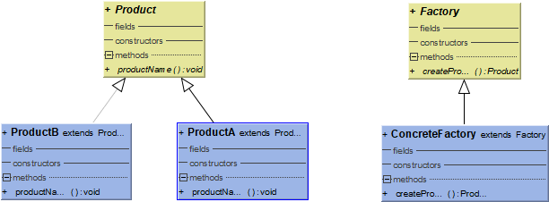
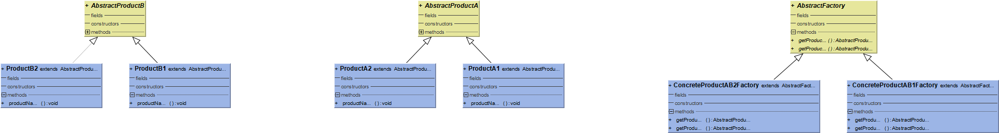

# Design-Patterns
# Java设计模式
* [一、创建型]()
    * [1. 单例（Singleton）](#1-单例singleton)
    * [2. 工厂方法模式(FactoryMethod)](#2-工厂方法模式factorymethod)
    * [3.抽象工厂(AbstractFactory)](#3-抽象工厂abstractfactory)


### 1. 单例（Singleton）


```java

/**
 * 懒汉式-线程不安全
 * 多线程下产生多个实例
 */
public class Singleton {
    private static  Singleton instance;

    private Singleton(){

    }
    public static Singleton getInstance() {
        if (instance==null){
            instance=new Singleton();

        }
        return instance;
    }

}


/**
 * 懒汉式-线程安全
 *
 *
 */
public class Singleton {
    private static  Singleton instance;
    private Singleton(){

    }
    public static synchronized Singleton getInstance(){
        if(instance==null){
            instance=new Singleton();

        }
        return instance;
    }
    /**
     * synchronized 关键字的三种应用方式
     *
        synchronized关键字最主要有以下3种应用方式，下面分别介绍

            1.修饰实例方法，作用于当前实例加锁，进入同步代 码前要获得当前实例的锁

            2.修饰静态方法，作用于当前类对象加锁，进入同步代码前要获得当前类对象的锁

            3.修饰代码块，指定加锁对象，对给定对象加锁，进入同步代码库前要获得给定对象的锁。
     *
     *
     */
}


/**
 * 饿汉式-线程安全
 * 缺点不使用的情况下也会实例化，占用资源
 */
public class Singleton {

    private static Singleton instance=new Singleton();
    private Singleton(){

    }

    public static Singleton getInstance() {
        return instance;
    }
}


/**
 * 双重校验锁-线程安全
 */
public class Singleton {

    private volatile static Singleton instance;
    private Singleton(){

    }

    public static Singleton getInstance(){
        if(instance==null){
            synchronized(Singleton.class){
                if (instance==null){
                    instance=new Singleton();
                }
            }
        }
        return instance;

    }
    /**
     * 使用 volatile 可以禁止 JVM 的指令重排，保证在多线程环境下也能正常运行。
     */

}


/**
 * 静态内部类实现-线程安全
 * 延迟初始化，jvm提供线程安全
 * 当 Singleton 类加载时，静态内部类 SingletonHolder 没有被加载进内存。
 * 只有当调用 getUniqueInstance() 方法从而触发 SingletonHolder.INSTANCE 时
 * SingletonHolder 才会被加载，此时初始化 INSTANCE 实例。
 *
 */
public class Singleton {

    private Singleton(){

    }
    public static class SingletonHolder{
        private final static Singleton instance=new Singleton();
    }

    public static Singleton getInstance(){
        return SingletonHolder.instance;
    }

}


/**
 * 枚举方式
 * 最好的单例方式
 * 这是单例模式的最佳实践，它实现简单，并且在面对复杂的序列化或者反射攻击的时候，能够防止实例化多次。
 */
public class   Singleton {

    private Singleton(){

    }
    public static Singleton getInstance(){
        return SingletonHolder.INSTANCE.getInstance();
    }

    public enum SingletonHolder{
        INSTANCE;
        private Singleton instance;
        private SingletonHolder(){
            instance=new Singleton();
        }
        private  Singleton getInstance(){
            return instance;
        }

    }


}
```
### 2. 工厂方法模式(FactoryMethod)
 
#### 类图

<div align="center">  </div><br>

#### 实现方式(一)
```java

/**
 * 工厂抽象类
 */
public abstract class Factory {
    /**
     * 抽象方法返回产品
     * @return
     */
    public abstract Product createProdct();

}


public  abstract class   Product {

    public abstract void productName();

}


/**
 * 工厂实现类返回相应的产品
 */
public class ConcreteFactory extends Factory {
    /**
     * 返回Product 实现类 ProductA 或者Product B
     * @return
     */
    @Override
    public Product createProdct() {

        return  new ProductA();
        //return  new ProductB();
    }
}

/**
 * 产品实现类A
 */
public class ProductA extends Product {
    @Override
    public void productName() {
        System.out.print("产品A");
    }
}

/**
 * 产品实现类B
 */
public class ProductB extends Product {
    @Override
    public void productName() {
        System.out.print("产品B");
    }
}
```
#### 实现方式(二)

```java
/**
 * 使用反射获得产品类
 */
public abstract class Factory {
    /**
     * @param clazz 需要实现的产品类
     * @return
     */
    public abstract <T extends Product> T createProduct(Class<T> clazz);
}

/**
 * 通过反射实现产品类
 */
public class ConcreteFactory extends Factory {
    @Override
    public <T extends Product> T createProduct(Class<T> clazz) {
        Product p=null;
        try {
            p= (Product) Class.forName(clazz.getName()).newInstance();
        } catch (Exception e) {
            e.printStackTrace();
        }
        return (T) p;
    }
}

/**
 *使用方法 
 * 
 */
public class Client {

    @Test
    public void Test() {
        ConcreteFactory concreteFactory = new ConcreteFactory();
        Product prodct = concreteFactory.createProdct();
        prodct.productName();
    }
    @Test
    public void Test2(){
        FactoryMethod.imp2.ConcreteFactory factory=new FactoryMethod.imp2.ConcreteFactory();
        Product p=factory.createProduct(ProductB.class);
        p.productName();

    }

}
```
### 3. 抽象工厂(AbstractFactory)
#### 类图

<div align="center">  </div><br>

#### 实现代码

```java

package AbstractFactory;

public abstract class AbstractFactory {

    public abstract AbstractProductA getProductA();
    public  abstract AbstractProductB getProductB();
}

public class ConcreteProductAB1Factory extends AbstractFactory {
    @Override
    public AbstractProductA getProductA() {
        return new ProductA1();
    }

    @Override
    public AbstractProductB getProductB() {
        return new ProductB1();
    }
}
public class ConcreteProductAB1Factory extends AbstractFactory {
    @Override
    public AbstractProductA getProductA() {
        return new ProductA1();
    }

    @Override
    public AbstractProductB getProductB() {
        return new ProductB1();
    }
}


package AbstractFactory;

public abstract class AbstractProductA {
    public abstract void productName();
}

public abstract class AbstractProductA {
    public abstract void productName();
}

public class ProductA1 extends AbstractProductA {
    @Override
    public void productName() {
        System.out.println("我是产品A1");
    }
}
public class ProductA2 extends AbstractProductA {
    @Override
    public void productName() {
        System.out.println("我是产品A2");
    }
}
public class ProductB1 extends AbstractProductB {
    @Override
    public void productName() {
        System.out.println("我是产品B1");
    }
}
public class ProductB2 extends AbstractProductB {
    @Override
    public void productName() {
        System.out.println("我是产品B2");
    }
}


  使用方式
  @Test
    public void TestAbstroctFactory(){
        AbstractFactory fAB1=new ConcreteProductAB1Factory();
        fAB1.getProductA().productName();

    }

```

